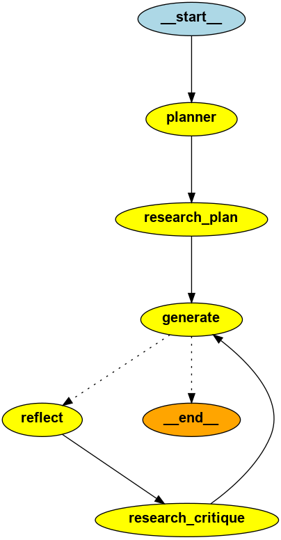
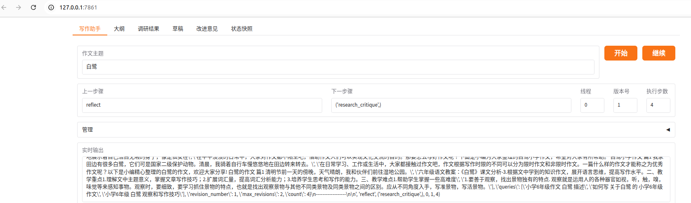
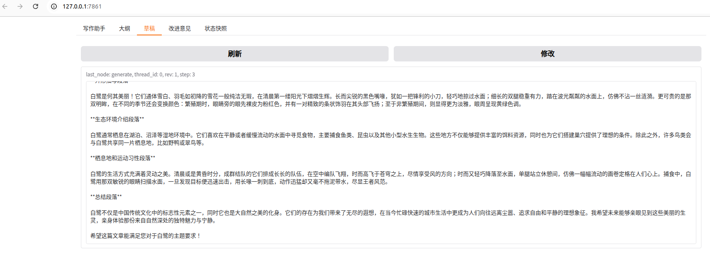
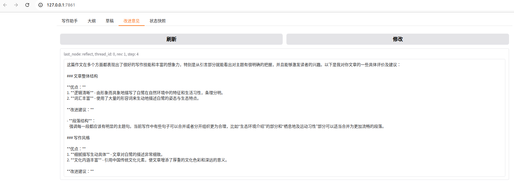

# FunLearning
基于LangGraph and Gradio的作文写作教学助手Agent。  

Graph结构：  

运行前，使用ollama本地部署的qwen2.5:32b模型。  
运行时，会要求输入Tavily搜索api key，需要提前到Tavily网站申请。  

运行：  
python FunLearning.py 

执行效果：  

Reference：  
https://www.deeplearning.ai/short-courses/ai-agents-in-langgraph  

